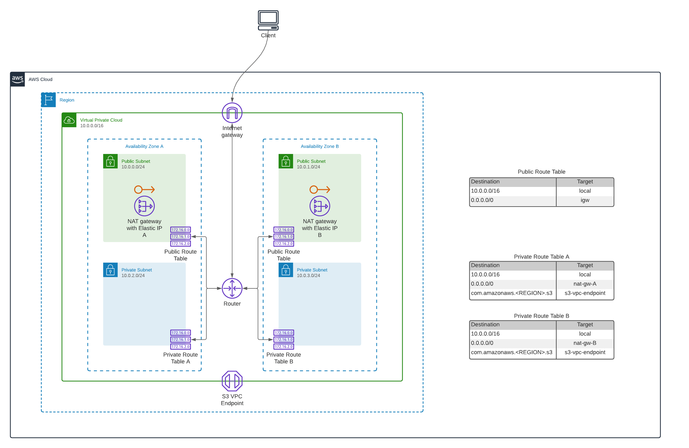

# Accurate Video on AWS Marketplace

## Step-by-step

### Step 1: Subscribe on AWS Marketplace

TODO: Insert link button to product

### Step 2: Setup HostedZone and CertificateManager

[Create a Hosted Zone](https://docs.aws.amazon.com/Route53/latest/DeveloperGuide/CreatingHostedZone.html) with a valid domain name, and [Create a certificate in ACM](https://docs.aws.amazon.com/acm/latest/userguide/gs-acm-request-public.html) for your Hosted Zone in the region that you want to run in.

TODO: Show where to get the Certificate ARN for a later step.
### Step 3: Create a new VPC (optional)

If you already have a VPC that you want to re-use, skip to step 4.

Click the button below to create a new VPC:

### Step 4: Launch the Accurate Video stacks

Click the button below to create a new deployment:

### Uninstall

1. Disable deletion protection on the Keycloak and Accurate Video RDS instances
2. Delete the main stack, which will delete the child stacks automatically
3. Delete the VPC stack
4. Unsubscribe on marketplace

## Architecture

### Services

### VPC

All traffic to and from the internet passes through the Internet Gateway. Access to the internet from the private subnets is done via NAT Gateways placed in both public subnets.
Traffic with an S3 bucket as destination will not be routed over the public internet, but instead via an S3 VPC Endpoint directly over the AWS backbone network.

### Security Groups

Security groups are in place to restrict network access to the different resources. The only one that allows direct access from the internet is the public Application Load Balancer (ALB), and this is restricted to TCP traffic on port 80 as we are currently running HTTP.

The Frontend, Analyze and Adapter services allow TCP traffic coming from the public ALB to their respective ports, the Adapter service also allows TCP traffic coming directly from the Jobs service. The RDS database only allows TCP traffic on port 5432 (PostgreSQL) coming from the Adapter service. To allow service discovery and communication with Hazelcast, ports 5699-5702 between Jobs and Adapter service are open both directions.

