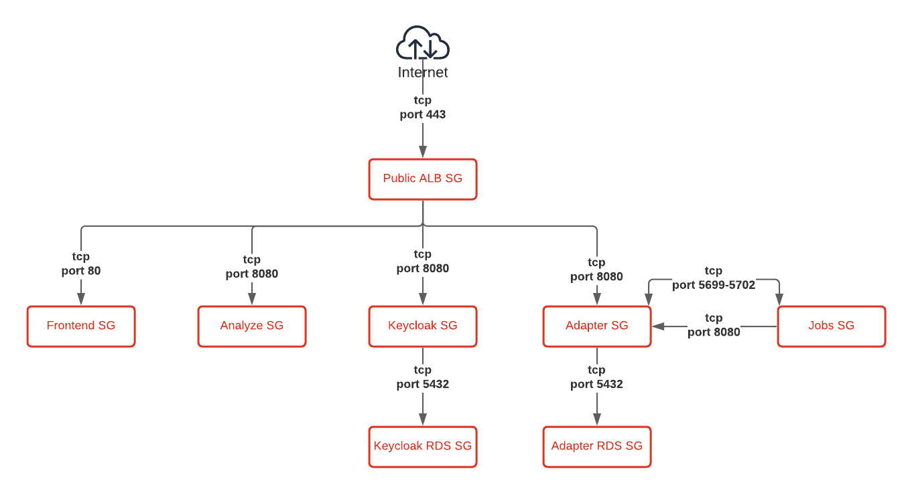

# Accurate Video on AWS ECS

## Usage

### Prerequisites

- Install [AWS CLI](https://aws.amazon.com/cli/)
- [Configure CLI](https://docs.aws.amazon.com/cli/latest/userguide/cli-configure-quickstart.html)

- Route53 Hosted Zone in which a DNS record pointing to the load balancer will be created [Create Hosted Zone](https://docs.aws.amazon.com/Route53/latest/DeveloperGuide/CreatingHostedZone.html)
- Certificate stored and validated in CertificateManager which covers the domain name that the load balancer will be given [Create certificate in ACM](https://docs.aws.amazon.com/acm/latest/userguide/gs-acm-request-public.html)

### Configuration

### Create ECS cluster running Accurate Video
* Log in to your AWS account

* [Launch CloudFormation Stack](https://console.aws.amazon.com/cloudformation/home?#/stacks/quickcreate?templateUrl=https%3A%2F%2Fs3.eu-north-1.amazonaws.com%2Fcf-templates-13ptaa61e3457-eu-north-1%2F2020323trb-main.yaml) will take you to the launch wizard in CloudFormation.

* Change region to where you want Accurate Video to be deployed.

## Architecture

### Services

### VPC

All traffic to and from the internet passes through the Internet Gateway. Access to the internet from the private subnets is done via NAT Gateways placed in both public subnets.
Traffic with an S3 bucket as destination will not be routed over the public internet, but instead via an S3 VPC Endpoint directly over the AWS backbone network.

### Security Groups

Security groups are in place to restrict network access to the different resources. The only one that allows direct access from the internet is the public Application Load Balancer (ALB), and this is restricted to TCP traffic on port 80 as we are currently running HTTP.

The Frontend, Analyze and Adapter services allow TCP traffic coming from the public ALB to their respective ports, the Adapter service also allows TCP traffic coming directly from the Jobs service. The RDS database only allows TCP traffic on port 5432 (PostgreSQL) coming from the Adapter service. To allow service discovery and communication with Hazelcast, ports 5699-5702 between Jobs and Adapter service are open both directions.

